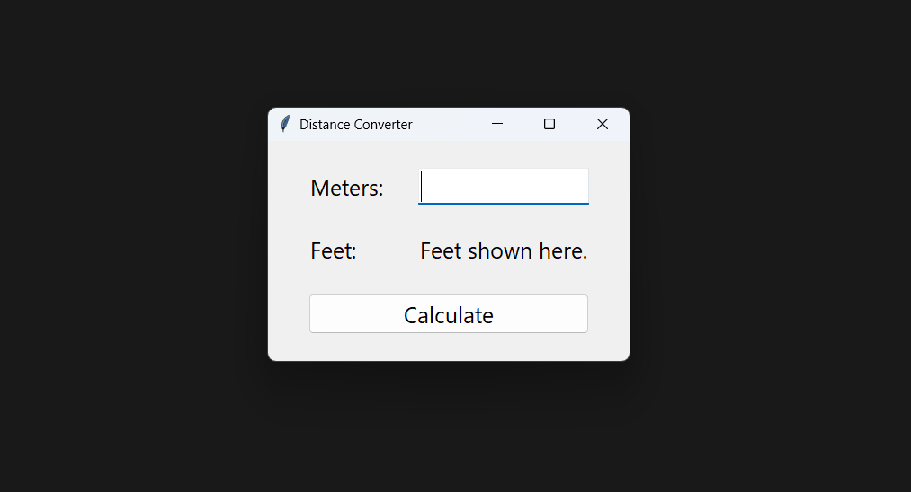

# 🧮 Distance Converter (Meters ➝ Feet)

A clean and minimal **Python Tkinter GUI application** that converts **meters to feet** with precise formatting, keyboard shortcuts, and a DPI-aware interface for crisp visuals on Windows.  
Perfect as a beginner-friendly portfolio project showcasing Python GUI development.

---

## 🖼️ Preview

Below is a screenshot of the running application:



---

## 🚀 Features

- **Simple & intuitive UI** using `tkinter` and modern `ttk` widgets  
- **Accurate conversion** (`1 meter = 3.28084 feet`)  
- **Formatted output** to **three decimal places**  
- **Keyboard shortcuts:**  
  - `Enter` / `NumPad Enter` → Calculate  
  - `Q` / `q` → Quit the app  
- **Clean layout** with padding and proper widget alignment  
- **Windows DPI-awareness support** for sharper visuals

---

## 📂 Project Structure

```
README.md            # Documentation
app.py               # Main Tkinter application
windows.py           # Optional Windows DPI-awareness helper
screenshot.png       # App preview image
```

---

## 🛠️ Installation & Usage

### **1. Clone or download the project**
```bash
git clone https://github.com/hackwithhimanshu/Distance_Converter_GUI_via_Python.git
cd Distance_Converter_GUI_via_Python
```

### **2. Run the application**
```bash
python app.py
```

> **Note:**  
If you're not on Windows or don’t want DPI awareness, comment/remove:
```python
from windows import set_dpi_awareness
set_dpi_awareness()
```

---

## 🧠 How It Works

- User enters meters → stored in a `StringVar()`  
- Press **Enter** or click **Calculate**  
- Value is converted using:  
  ```python
  feet = metres * 3.28084
  ```
- Displayed with proper formatting:  
  ```python
  f"{feet:.3f}"
  ```
- Any invalid input is safely ignored without crashing.

---

## 🎮 Keyboard Shortcuts

| Action        | Shortcut                |
|---------------|--------------------------|
| Calculate     | **Enter**, **KP_Enter** |
| Quit App      | **Q**, **q**            |

---

## 🌱 Future Improvements

- Add reverse conversion (Feet ➝ Meters)  
- Add validation/error messages  
- Add more unit conversion options  
- Package as `.exe` using PyInstaller  
- Add dark mode  

---

## 📜 License

This project is released under the **MIT License**.  
Feel free to use, modify, and build upon it.

---

## ⭐ Support

If you found this useful, star the repo or connect with me!  
Happy coding 🚀

